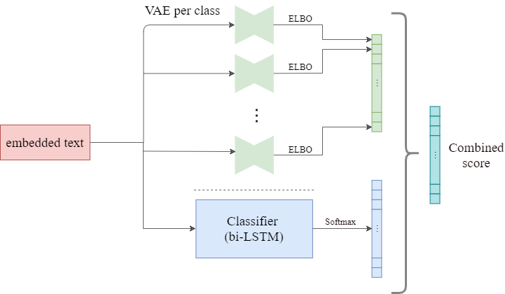

# Boosting Text Classifiers by Generative Modelling

The aim of this project is to boost a simple classifier using per-class generative models that leverage the underlying per-class data marginal distribution. 
For this purpose we have implemented a LSTM for classification and VAEs for each class in our dataset. 
We demonstrate the promising results of this ensemble approach to boosting in our research paper. -MAYBE GIVE A LINK for paper in repo(if u wanna put it in)?-



# Usage
 The implementation offers many different models, loss functions etc. to pick from, hence there are many configurations. 
 To run training or testing you need our pre-processed data sets which take up quite some space so they're not provided in this repository. 
 
## Training
Here you can find our final training preferences:
 -IF ITS BETTER ADD A LINK TO THE JOB THING- 
    
## Testing
Our final testing preferences:
 -IF ITS BETTER ADD A LINK TO THE JOB THING- 

### Loading already acquired results
We also provide a pickle file which loads a dictionary of our test logs consisting of combined, LSTM and VAE-Classifier models score results. 
These can be directly loaded and processed if run the test preferences with --skip_test.

# Configurations
#### List of parameters (this is konstantins) (maybe we can skip this:D dont bother)

| Parameter     | type          | default value  | description |
| ------------- |:-------------:| --------------:|-------------|
| `--save_every_steps` | int | 1000 | Number of steps after which the model will be saved|
| `--log_every_steps` | int | 50 | Number of steps after which the current results will be printed|
| `--max_samples` | int | `None` | Number of samples to get from the datasets. If None, all samples will be used|
| `--snapshot_location` | str | `None` | Snapshot location from where to load the model|
| `--batch_size` | int | 64 | Batch size to use for the dataset |
| `--max_epochs` | int | 100 | Amount of max epochs of the training|
| `--learning_rate` | float | 0.1 | Learning rate |
| `--encoding_model` | str | `mean` | Model type for encoding sentences. Choose from `mean`, `uni-lstm`, `bi-lstm` and `bi-lstm-max-pool`|
| `--weight_decay` | float | 0.01 | "Weight decay for the optimizer")|

#### Training Example (this is konstantins)

```
python train.py --encoding_model=mean --weight_decay=0.1 --max_samples=10 --log_every_steps=100 --max_epochs=10000 --batch_size=64
Arguments:
save_every_steps : 1000
log_every_steps : 100
max_samples : 10
snapshot_location : None
batch_size : 64
max_epochs : 10000
learning_rate : 0.1
encoding_model : mean
weight_decay : 0.1
-----------------------------------------
Loading data...
Loading model...
Starting training...
  Time Epoch Iteration Progress    (%Epoch)   Loss   Dev/Loss     Train/Micro-Accuracy  Train/Macro-Accuracy  Dev/Micro-Accuracy  Dev/Macro-Accuracy
     2     0         0     1/1         100% 1.104041 --------                  30.0000               30.0000 ------------------- -------------------
     2     0         1 ----------- ---------  ------ 1.109723                  30.0000               30.0000             30.0000             30.0000
     2     1         2 ----------- ---------  ------ 1.116314                  40.0000               40.0000             30.0000             30.0000
     2     2         3 ----------- ---------  ------ 1.118268                  40.0000               40.0000             30.0000             30.0000
     2     3         4 ----------- ---------  ------ 1.118569                  40.0000               40.0000             30.0000             30.0000
     ...
```

#### Testing Example


```
python main.py
--test-mode
--analysis 
--classifier CombinedClassifier
--dataset_class LyricsDataset 
--dataset_class_sentencevae LyricsRawDataset
--generator SentenceVAE
--loss VAELoss
--num_classes 5 --embedding_size 256  --learning_rate 0.005 
--hidden_dim 128 --hidden_dim_vae 256 --z_dim 64 --batch_size 1 
--combined_classification 
--classifier_dir full_lstm 
--vaes_dir full_vae\country,full_vae\hip-hop,full_vae\metal,full_vae\pop,full_vae\rock 
--classifier_name model_best --vaes_names model_best,model_best,model_best,model_best,model_best 
--combination learn_sum
--combined_weights combine
```

LINK TO DATASET MAYBE?

## Links: (delete these at the end)

https://drive.google.com/open?id=12zTpLuKhGhmM5Ql2QvxoM0J3OJExbAo6

https://onedrive.live.com/?authkey=%21AERWc2QlWN0yqKE&id=5574F751815D9FB1%211766753&cid=5574F751815D9FB1

https://www.overleaf.com/2949321739vycbcgjmcddj

https://drive.google.com/drive/folders/1fj0jnOnTZAzYuimKFLfoqKLt2B8c7KZ4?usp=sharing


## sources:

https://arxiv.org/abs/1804.03599

http://proceedings.mlr.press/v70/yang17d/yang17d.pdf

https://github.com/kefirski/contiguous-succotash

https://arxiv.org/pdf/1809.03259.pdf

https://arxiv.org/pdf/1511.06349.pdf

https://arxiv.org/pdf/1809.03259.pdf
